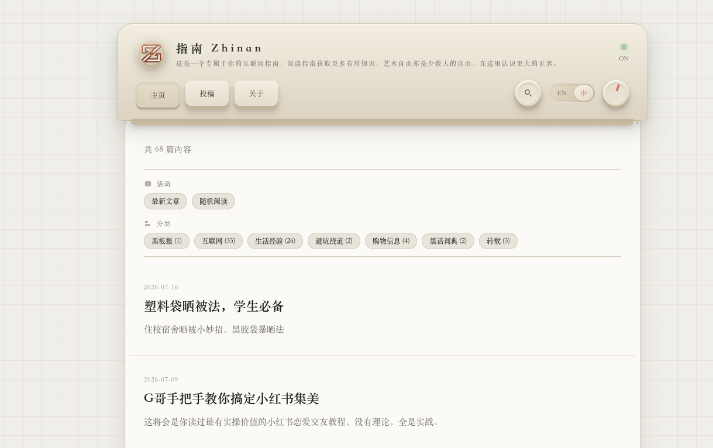

# Printer（Typecho 主题）

Printer 是一款仿打印纸 / 复古设备面板风格的 Typecho 主题，复刻自 [NOOC](https://nooc.me/) 的视觉方向并移植到 Typecho。主题支持黑暗模式、中文网字计划、自定义颜色、自定义背景、访问统计、社交链接和移动端适配。



## 特性

- 复古打印纸视觉：网格背景、纸张横线、拟物按钮和设备面板式顶部栏。
- 日夜模式：前端切换并通过 `localStorage` 记忆用户偏好。
- 中文字体支持：可接入中文网字计划等第三方字体 CSS，并按范围应用字体。
- 首页信息区：展示最新文章、随机阅读入口和分类列表。
- 文章页体验：分类标签、发布日期、预计阅读时长、阅读进度条、上一篇 / 下一篇导航。
- 评论区：适配 Typecho 原生评论、分页和登录态。
- 访问统计：支持总访问、今日访问、初始访问量和访问计数增量。
- AI 可读内容出口：在首页和文章页输出 Schema.org JSON-LD，并直接提供可访问的 `/llms.txt` Markdown 索引。
- 社交链接：支持 GitHub、Twitter / X、微博、邮箱和 RSS。
- 响应式适配：覆盖手机、横屏移动端、平板、触摸设备和减少动画偏好。

## 部署 / 安装

1. 将本主题目录上传到 Typecho 站点主题目录。
   - 默认路径：`/usr/themes/`
   - 示例路径：`/usr/themes/Printer/`
2. 登录 Typecho 后台，进入 **控制台** → **外观**。
3. 启用主题 **Printer**。
4. 进入 **设置外观** → **Printer**，按需填写主题配置。

## 目录结构

- `index.php`：主题信息、首页、归档页、分类页、标签页和搜索结果列表。
- `post.php`：文章详情页。
- `page.php`：独立页面详情页。
- `archive.php`：复用 `index.php` 输出归档类页面。
- `comments.php`：评论列表和评论表单。
- `header.php`：公共头部、导航、搜索、日夜模式按钮、自定义字体和背景变量。
- `footer.php`：公共页脚、社交链接、访问统计输出和前端交互脚本。
- `LLM.php`：AI 可读 Markdown 内容出口页面模板，可作为 `/llms.txt` 的兼容备用入口。
- `functions.php`：主题配置项、颜色和字体清洗、随机文章、访问统计辅助函数。
- `404.php`：404 页面。
- `css/style.css`：主题样式。
- `screenshot.png`：主题预览图。

## 主题设置

### 基础设置

- **Logo 图片**：填写图片链接后替换左上角圆形图标。支持常见图片格式，建议尺寸 100 × 100 像素。
- **网站名称**：显示在 Logo 旁边。留空时使用 Typecho 后台站点标题。
- **网站副标题**：显示在网站名称下方。留空时使用 Typecho 后台站点描述。
- **浏览器标签页图标**：填写 favicon 图片链接。
- **页脚版权文字**：显示在页面底部。留空时显示 `© 年份 网站名称`。

### 内容设置

- **随机阅读范围**：限制首页“随机阅读”只从指定分类中选取文章。填写分类别名，多个分类用英文逗号分隔，例如 `life,tech`。留空时从全站已发布文章中随机。
- **阅读时间估算**：控制文章页是否显示预计阅读时长。

### AI 可读内容出口

- **结构化数据 JSON-LD**：控制是否在首页和文章页输出 Schema.org JSON-LD。
- **站点 AI 摘要**：用一两句话说明本站主题、内容范围和适合回答的问题。留空时使用 Typecho 站点描述。
- **发布者名称**：用于结构化数据中的 `publisher.name`。留空时使用网站名称。
- **发布者 Logo**：用于结构化数据中的 `publisher.logo`。留空时使用 Logo 图片配置。
- **LLM 页面出口**：控制 `/llms.txt` 和 `LLM.php` 页面模板是否输出机器可读 Markdown 索引。
- **LLM 出口标题**：显示在 Markdown 索引顶部的标题。
- **推荐读取说明**：告诉 AI 应该如何读取本站内容。留空时使用主题默认说明。
- **适合回答的问题**：说明本站内容适合支持哪些问题或任务。
- **不提供内容说明**：说明哪些内容不建议 AI 当作知识来源，如评论区、后台页面、动态统计等。
- **引用说明**：说明 AI 或用户引用本站内容时应如何署名和附链接。
- **最近文章数量**：控制 LLM 页面输出的最近文章数量，建议 10-50。
- **文章输出模式**：可选择仅标题链接、标题链接和摘要、包含正文摘录。
- **包含分类列表 / 独立页面**：控制是否在 LLM 页面输出分类和独立页面入口。
- **RSS 地址 / 站点地图地址**：输出到 LLM 页面中的机器发现入口。

当前版本会在首页输出 `WebSite`、`Blog` 和 `SearchAction`，在文章页输出 `BlogPosting`。主题启用后会在 `/llms.txt` 输出面向 AI agents 和 crawlers 的 Markdown 内容路线图，内容复用 `LLM.php` 的渲染逻辑。

#### `/llms.txt` 路由安装与使用

主题内置了最小可用的路由适配，不需要额外安装插件：

1. 在 Typecho 后台启用 **Printer** 主题。
2. 进入 **设置外观** → **Printer**，确认 **LLM 页面出口** 为“启用”。
3. 确认 **LLM 页面地址** 保持默认 `/llms.txt`，或按需填写完整地址。
4. 访问 `https://你的域名/llms.txt`，应返回 `text/markdown; charset=UTF-8` 的 Markdown 索引。

如果站点没有开启伪静态，服务器可能不会把 `/llms.txt` 转给 Typecho。此时可以先访问 `https://你的域名/index.php/llms.txt` 作为降级地址，或在 Web 服务器中把 `/llms.txt` rewrite 到 Typecho 的 `index.php`。例如 Nginx 可使用：

```nginx
location = /llms.txt {
    try_files $uri /index.php/llms.txt;
}
```

Apache 通常跟随 Typecho 伪静态规则即可；如果单独放行静态文件导致 404，请确保 `/llms.txt` 会进入 Typecho 入口。

### 外观样式

- **中文字体 CSS 链接**：填写中文网字计划或其他字体服务提供的 CSS 链接。主题只接受 `http` / `https` 链接。
- **中文字体名称**：填写 CSS 中声明的 `font-family`。包含空格时可以写成 `"LXGW WenKai"` 这类形式。
- **字体应用范围**：
  - 仅文章内容（推荐）
  - 纸张区域（含列表页）
  - 全站所有文字
- **外部链接颜色**：文章中指向外部网站的链接颜色，默认 `#ff6b35`。
- **文章分类颜色**：文章详情页顶部分类标签颜色，默认 `#ff6b35`。
- **自定义背景图**：填写背景图片链接。主题只接受 `http` / `https` 链接。
- **黑暗模式背景压暗强度**：控制黑暗模式下背景图遮罩强度，范围 `0` 到 `1`，默认 `0.65`。

### 统计与追踪

- **网站统计代码**：粘贴第三方统计平台脚本，主题会输出在页面底部。
- **初始总访问量**：设置总访问量基数，适合从其他平台迁移时使用。
- **今日初始访问量**：设置今日访问量基数。
- **访问计数增量**：每次有效访问增加的数值，默认 `1`。

访问统计会自动创建 `printer_visit_stats` 数据表，并通过 Cookie + Session 做当天访问去重。由于主题会输出动态访问数据，不建议对整个页面做会吞掉动态内容的静态缓存。

### 社交链接

- **GitHub**：填写 GitHub 主页链接。
- **Twitter / X**：填写 Twitter / X 主页链接。
- **微博**：填写微博主页链接。
- **邮箱**：填写联系邮箱地址。
- **RSS 订阅地址**：填写 RSS 链接，例如 `/feed/` 或完整 RSS URL。
- **LLM 页面地址**：填写当前站点的 LLM 内容出口地址，支持站内相对地址或完整 URL；默认 `/llms.txt`。填写后会像 RSS 一样在页面 `<head>` 和页脚图标中输出 `text/markdown` 发现入口。

对应字段留空时，页脚不会显示该社交图标。

## 使用说明

- 顶部搜索按钮首次点击会展开搜索框，再次提交时执行 Typecho 站内搜索。
- 日夜模式按钮会把偏好保存到浏览器本地。
- 文章阅读进度条只在文章内容足够长时显示。
- 返回顶部按钮会在页面向下滚动后出现。
- 首页“随机阅读”会尽量避开最新文章，避免两个入口指向同一篇。
- 推荐直接使用内置 `/llms.txt`。如需兼容旧方式，也可以在 Typecho 后台新建独立页面，选择 `LLM.php` 模板，并把页面地址填入“LLM 页面地址”。

## 兼容与注意事项

- 主题依赖 Typecho 原生模板接口和数据库接口。
- `/llms.txt` 依赖请求进入 Typecho 入口；未开启伪静态时请使用 `/index.php/llms.txt` 或配置 Web 服务器 rewrite。
- 访问统计功能需要数据库有建表权限。
- 自定义字体 CSS 和自定义背景图建议使用稳定的 HTTPS 链接。
- 若站点启用了 CDN 或页面缓存，请确保不会缓存所有访客共用的动态访问统计结果。

## 致谢

- [NOOC](https://nooc.me/)：本主题复刻的视觉起源。
- [中文网字计划](https://github.com/KonghaYao/chinese-free-web-font-storage)：免费的中文 Web 字体库，支持在线加载及查看字体信息。
